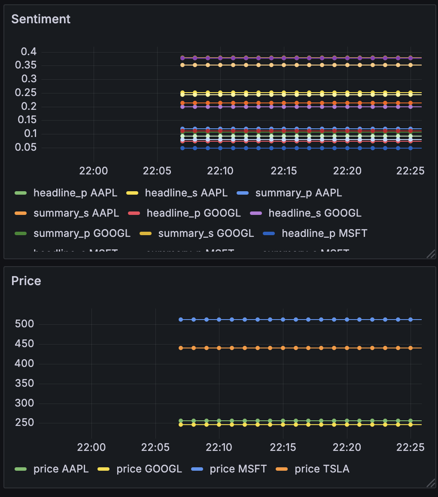

# Stock Market Visualzier

A simple real-time visualizer and aggregator for stock prices, headline sentiment scores, and related data sourced from FinnHub. Built with Kafka, InfluxDB, and Grafana. 




## To Run

1. Prepare all necessary environment variables

2. Specify the stocks you want to track in both producer files. 

3. Run `docker compose up -d`

4. Run each of these in their own terminals:

 `python3 consumer.py` `python3 stock_producer.py` `python3 news_producer.py`

5. Access Grafana in a browser and configure a dashboard that reads from your InfluxDB as a Data Source

4. Write Flux queries such as:

```
from(bucket: "{BUCKET_NAME}")
  |> range(start: -30m)  // Last 30 minutes
  |> filter(fn: (r) => r._measurement == "stock_price")
  |> filter(fn: (r) => r._field == "price")
  |> filter(fn: (r) => 
    r.symbol == "AAPL" or 
    r.symbol == "MSFT" or 
    r.symbol == "TSLA" or 
    r.symbol == "GOOGL"
  )
  |> aggregateWindow(every: 1m, fn: mean, createEmpty: false)
  |> yield(name: "mean")
```

To create real-time visualizers.

6. For a complete teardown and deletion of written data, run

`docker compose down --volumes`


## To Do

- [] More commprehensive sentiment score
- [] Add Insider Trading producer
- [] Research APIs to provide Gold, Oil, and Crypto market data